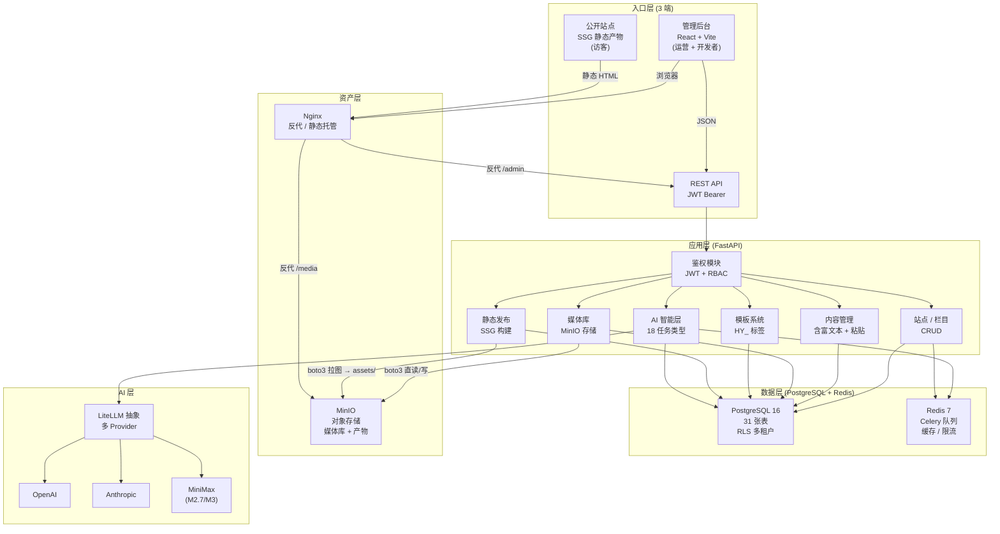
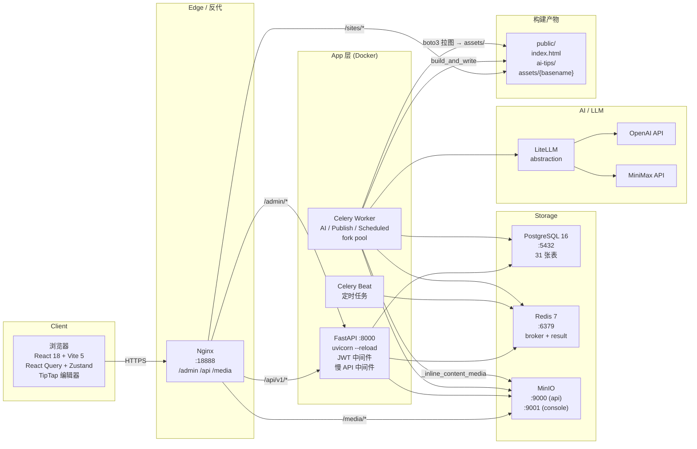
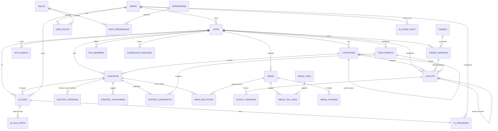
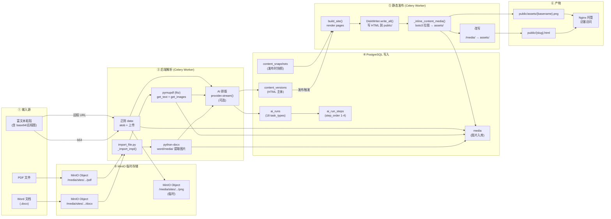
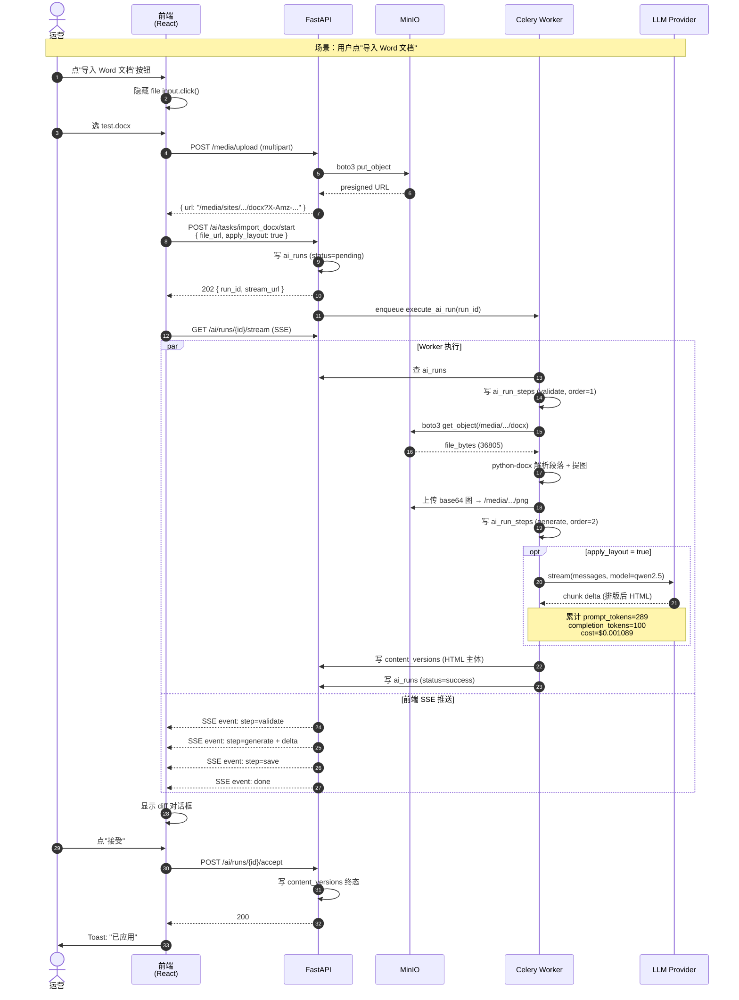
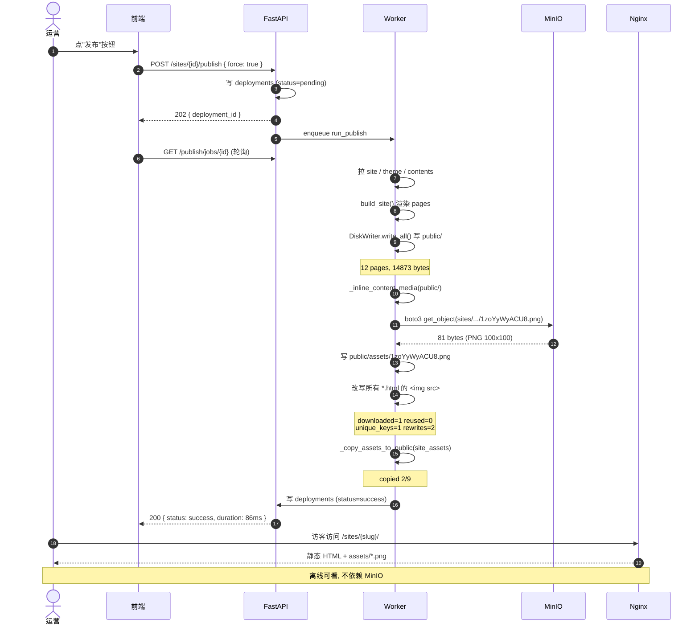

# 19. 架构图集 (P3.9.5+ 截至 2026-06-12)

> 本文档以 mermaid 形式汇总产品/技术/数据库/血线/序列图。  
> 5 张图，对应 holy 反馈点：文档导入 + 静态发布图片真静态化 + LLMRequest 修。  
> **核心变化**（P3.9.4 → P3.9.5）：
> 1. **新增 ai_run_steps / ai_usage_daily / media_tags / media_tag_links / site_assets** 等 P3 表
> 2. **ai_runs.task_type** 18 个值（含 3 个 import_*）
> 3. **静态发布产物**改为 `public/assets/{basename}.png` 相对路径，**离线可看**

---

## 1. 产品架构图

定位：给 PM/运营看，分 5 层 — 入口层 / 应用层 / 数据层 / 资产层 / AI 层。

**关键路径**：
- 写入：`Admin → API → FastAPI → PG + MinIO`（同步）
- AI：`API → Celery → Worker → LiteLLM → Provider`（异步，SSE 推流）
- 发布：`API → Celery → Worker → boto3 拉图 → 本地写 HTML → Nginx 托管`

---

## 2. 技术架构图

定位：给开发看，分 6 层 — Client / Edge / App / Worker / Storage / AI。

**关键流程时序**：
1. **写内容**：Browser → Nginx → FastAPI → PG（事务）
2. **触发发布**：Browser → FastAPI → Celery enqueue → Worker run_publish
3. **Worker 内部**：
   - `build_site()` 渲染所有 pages（内存）
   - `DiskWriter.write_all()` 写 HTML 到 `public/`
   - `_inline_content_media(public/)` **boto3 拉 MinIO 图 → public/assets/，改写 ``** ← **P3.9.5 关键步骤**

---

## 3. 数据库架构图 (ER)

定位：31 张表全图 + 主外键。3 大域：身份/内容/AI/发布。

**31 张表清单**（P0=1, P1=10, P2=4+1, P3=3+3, RBAC=6, 新增=3）：

| 域 | 表 | 关键 |
|---|---|---|
| **身份** | users, site_members, invitations, roles, permissions, user_roles, role_permissions | RBAC 4 表（P3.6） |
| **站点** | sites, site_domains, site_assets | 多租户 + 静态资源 |
| **栏目/内容** | categories, contents, content_taxonomies, content_versions, content_snapshots | 版本永删 + 软删 |
| **媒体** | media, media_folders, media_relations, media_tags, media_tag_links | 标签 + 文件夹 |
| **模板/主题** | layouts, layout_versions, themes, theme_versions | 版本化 + 继承 |
| **发布** | deployments, scheduled_publishes | scope=site/cat/content（P3.6.1） |
| **AI** | ai_providers, ai_runs, ai_run_steps, ai_usage_daily | 18 任务类型（P3.9.5+） |
| **其他** | taxonomies, audit_logs, alembic_version | |

---

## 4. 数据血缘图 (Lineage)

定位：从 **写入端 → 数据库 → 静态产物** 的全链路血缘。聚焦 P3.9.5 文档导入 + 静态发布两条关键链路。

**关键血缘点**（P3.9.5 重要）：
- **图 1（写入）**：输入 → MinIO（临时）→ 后端解析 → `media` 表 + `content_versions` 表
- **图 2（AI 跑）**：每个 AI run 写 `ai_runs` + `ai_run_steps` (4 步: validate/generate/save/done)
- **图 3（发布）**：`build_and_write` 写完 HTML → **`_inline_content_media` 后处理** → 改 `` 为相对路径 → 产物离线可看

---

## 5. 产品流程图（多泳道序列图）

定位：**文档导入**完整流程，6 泳道 — Browser / Frontend / FastAPI / Worker / MinIO / LLM。

**6 泳道**：
| 泳道 | 角色 | 关键动作 |
|---|---|---|
| 1 | 运营 | 选文件、点接受 |
| 2 | 前端 React | 隐藏 file input、调用 API、监听 SSE |
| 3 | FastAPI | multipart 上传、创建 ai_runs、enqueue、推 SSE |
| 4 | MinIO | put_object (上传)、get_object (worker 拉) |
| 5 | Celery Worker | 解析、boto3 拉、写 ai_run_steps、调 LLM stream |
| 6 | LLM Provider | 流式返排版 HTML |

**关键改进**（P3.9.5 相对 P3.9.4）：
- ✅ **`apply_layout` 真正生效**（`provider.stream` 接 token/cost）
- ✅ **图片真静态化**（发布时 `_inline_content_media` 改 `` 为 `assets/` 相对路径）

---

## 6. 静态发布序列图（多泳道）

定位：发布时的完整时序，5 泳道 — Browser / API / Worker / MinIO / Nginx。

**关键改进点**：
- P3.9.4 之前：`` → 必须经 nginx → MinIO 反代才能渲染
- P3.9.5 之后：`` → nginx 直接吐文件，**离线可看**

---

## 附录：图例 & 术语

| 术语 | 含义 |
|---|---|
| **P0/P1/P2/P3** | 项目阶段 0/1/2/3（0=脚手架, 1=内容+富文本+媒体, 2=主题+SSG+CDN, 3=AI+打磨） |
| **SSG** | Static Site Generation（静态站点生成） |
| **HY_** | Layout 标签占位符（`HY_SITE_MENU`/`HY_ITEM_TITLE` 等） |
| **task_type** | AI 任务类型（18 个：rewrite/expand/shorten/polish/translate/draft/audit/theme/image/optimize_design/responsive/a11y/seo/format_html/extract_assets/import_docx/import_pdf/import_paste_html） |
| **scope** | 发布粒度（site 全量 / category 栏目级 / content 文章级） |

---

**版本**：v3.9.5+ (2026-06-12 07:30)  
**覆盖范围**：截至 holy 反馈 #12096 续 (#137)  
**作者**：MiniMax-M3（基于 docs/04b 数据模型 + 12-P2 决策 + 13-P3 进度 + 现有 backend 代码）
